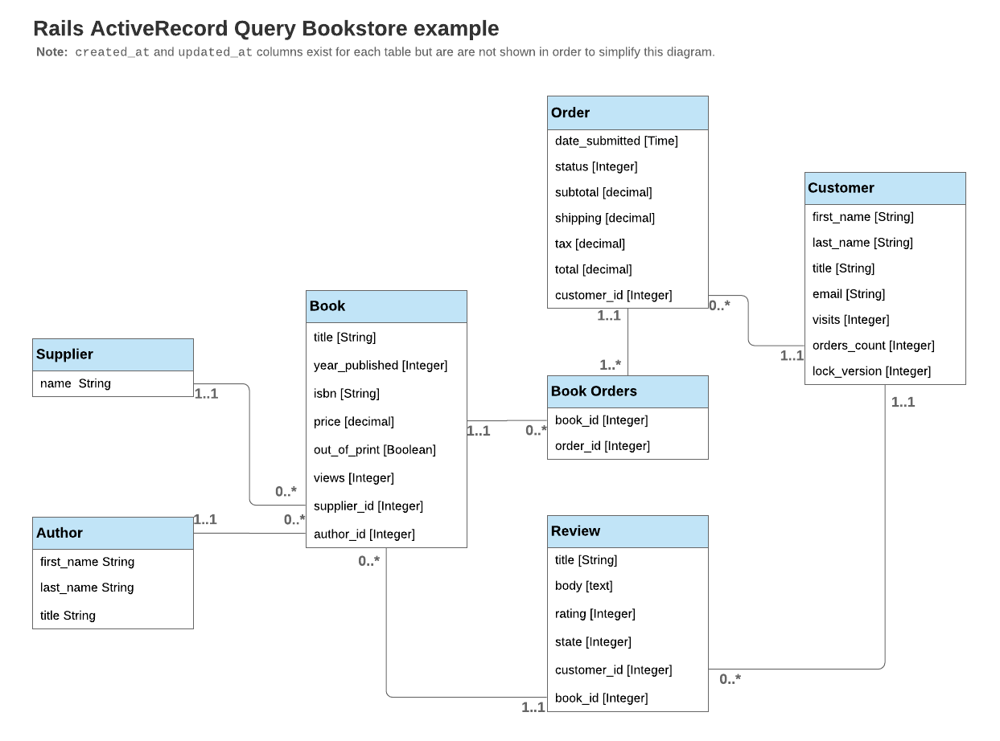

# Bookstore Models and Data

### for the [Rails Active Record Query Inteface Guide](https://guides.rubyonrails.org/active_record_querying.html)

_These models are actually for [a pull request (PR) submitted for the guide so that just one set of models is used for all examples.](https://github.com/rails/rails/pull/35008)  If the PR is accepted, then these will match up with what the guide says._

**Clone this repo to get a very simple Rails app with data that you can use to run the examples in the guide. [Use this draft version of the guide; it's the one with my proposed changed (based on the PR).](./guides/source/active_record_querying.md)**  Detailed installation instructions are in the [Installation and Use](installation-and-use) section below.

I created this to help people run and understand the examples in the Rails
  Guide. I want to save people --
           especially <em>novices</em> who are coming up many learning curves at once -- the time and effort
           needed to figure out exactly how to define and scaffold the models used in the
           examples.

**The goal is to present the models with just enough data so the examples can be
  run and explored.**

  - [Dependencies](#dependencies)
  - [Installation and Use](installation-and-use)
  - [Bookstore models diagram](bookstore-models)
  - [Giving Feedback](giving-feedback)

_This is a first draft.  The data does not yet match the example results in the guide exactly._

This is <em>not</em> a complete or efficient Rails application.

The models are defined like they are _as examples_ to illustrate code and concepts from the guide. They would not necessarily use the same definitions and methods in a real world Rails application. Only very minimal layout (view) work was done.

Read more about the details and intention on [the home page when you run this as a Rails app.](app/views/home/index.html.erb)  (This is a Rails `.html.erb` file.  It will fully readable when you run this as a Rails application.)

## Dependencies
- **[Rails 5.2.2](https://guides.rubyonrails.org/v5.2.2/)**  
  This may run just fine under earlier 5.x versions of Rails.  I have not tested it.  I made this to work with the examples in [the guide for Rails 5.2.2.](https://guides.rubyonrails.org/active_record_querying.html)

- **Sqlite3**  
  The `Gemfile` and `config/db` are set up to use this, but you can use whatever db you want. There's no code that is db specific.  Feel free to change the Gemfile and use the db of your choice)

- **[Ruby 2.5.1](http://www.ruby-lang.org/en/news/2018/03/28/ruby-2-5-1-released/)**  
  Ruby is a dynamic, open source programming language with a focus on simplicity and productivity. It has an elegant syntax that is natural to read and easy to write.

- **[Bootstrap 4.x](https://getbootstrap.com)**  
  Bootstrap is an open source toolkit for developing with HTML, CSS, and JS. Quickly prototype your ideas or build your entire app with our Sass variables and mixins, responsive grid system, extensive prebuilt components, and powerful plugins built on jQuery.

- **[FontAwesome Sass](https://github.com/FortAwesome/font-awesome-sass)**  
  A Sass-powered version of FontAwesome for your Ruby projects and plays nicely with Ruby on Rails, Compass, Sprockets, etc.

- **[Smarter CSV](https://github.com/tilo/smarter_csv)**  
  SmarterCSV is a Ruby Gem for smarter importing of CSV Files as Array(s) of Hashes, suitable for parallel processing with Resque or Sidekiq, as well as direct processing with ActiveRecord, Mongoiid.

## Installation and Use:

1. Clone or fork this repo

1. Ensure your database is configured: check `config/database.yml` to ensure the settings are right for your system.  
   (This uses SqlLite3.  If you want to use a different database, be sure to update the gem in the `Gemfile` and update the database settings.)
   [Read more about setting up your database in the Getting Started Rails Guide](https://guides.rubyonrails.org/getting_started.html)

2. `bin/rails db:setup` creates the database, runs the migrations, and seeds it with the example data.

2. Use the `rails console` to run the examples from the guide.

3. Run it as a local web application with `rails server` to see the data in web page views.  

## Bookstore models

## Giving Feedback
Is this helpful? How could it be made _more_ helpful? Please post comments and suggestions about the models and using them in the [Github repo issues queue.](https://github.com/weedySeaDragon/rails-guides-bookstore-models)
If you have feedback about *the guide,* please post your comments in [the Rails github repo.](https://github.com/rails/rails)

## MIT License

The authors and contributors have agreed to license all other software under the MIT license, an open source free software license. See the file named [LICENSE](LICENSE) which includes a disclaimer of warranty.
